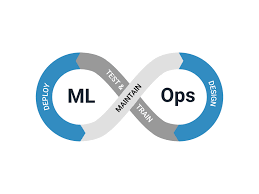

# 📂 Portafolio de Proyectos  

Bienvenido/a a mi portafolio de proyectos en **Ciencia de Datos y Machine Learning**.  
Aquí encontrarás una selección de mis trabajos más relevantes, que abarcan desde análisis exploratorio hasta modelos predictivos y proyectos de NLP.  

---

## Información de contacto

**Jorge Auad Oliva — Concepción, Chile**

---

## 🚀 Proyectos Destacados  

### 🧠 [Interpretabilidad de Scoring Crediticio](https://github.com/Koke-Oliva/Interpretabilidad-de-Scoring-Crediticio)

**Contexto:** proyecto de clasificación para *credit scoring* con datos públicos (OpenML).  
**Dataset:** `credit` (v1).  
**Enfoque:** split estratificado, escalado con `StandardScaler`, **Regresión Logística (L1/L2)** y **Random Forest** con **GridSearchCV** (`cv=5`, `roc_auc`).  
**Resultado:** el **Random Forest tunado** lidera (**ROC-AUC ≈ 0.839**, **F1 ≈ 0.760**).

**Tecnologías:**  

  

---

### 🧠 Clasificación de Notas Clínicas con BERT (NLP - Español)

**Contexto:** Modelo de procesamiento de lenguaje natural aplicado a notas clínicas médicas en español.  
**Objetivo:** Clasificación de severidad (leve, moderado, severo) utilizando BERT.  
**Evaluación:** F1 Macro ≈ **0.84**, buen desempeño con control de sesgos.  

**Tecnologías:**  

---
 ### ☁️ [MLOps en la Nube: Despliegue Automatizado de un Modelo Predictivo Real](https://github.com/Koke-Oliva/breast_cancer_api)

**Contexto:** proyecto de MLOps que implementa un flujo completo de *Machine Learning* con **Random Forest**, exponiendo el modelo como **API REST** mediante Flask, **contenedorizado con Docker** y con integración continua vía **GitHub Actions (CI/CD)**.  

**Ciclo de vida:** entrenamiento del modelo, creación de API, contenedorización y despliegue automatizado en **GitHub Container Registry (GHCR)**.  

**Tecnologías:**  

---

### 🗄️ [Manejo de Queries en SQL Server](https://github.com/Koke-Oliva/sql-server-gestion-colegio)  
Consultas SQL avanzadas para extracción y análisis de datos, con optimización de queries y ejemplos prácticos.  

**Tecnologías:**   

---

## 🧩 Microproyectos  
- 📌 Clustering jerárquico con Python.  
- 📌 Ejercicios SQL con queries avanzadas.  
- 📌 Modelos de regresión logística y árboles de decisión.  

---

## 🎓 Certificaciones y Formación  
- **Especialización en Machine Learning (198 hrs)** – Talento Digital para Chile.  
- **Bootcamp Full Stack Java (480 hrs)** – Desafío Latam.  
- **Diplomado en Data Science & Machine Learning** – PUCV.  
- Cursos adicionales: Power BI, SQL, Python con Jupyter Notebook, IA Generativa.  

---

## 🌐 Conecta conmigo  
  

  
