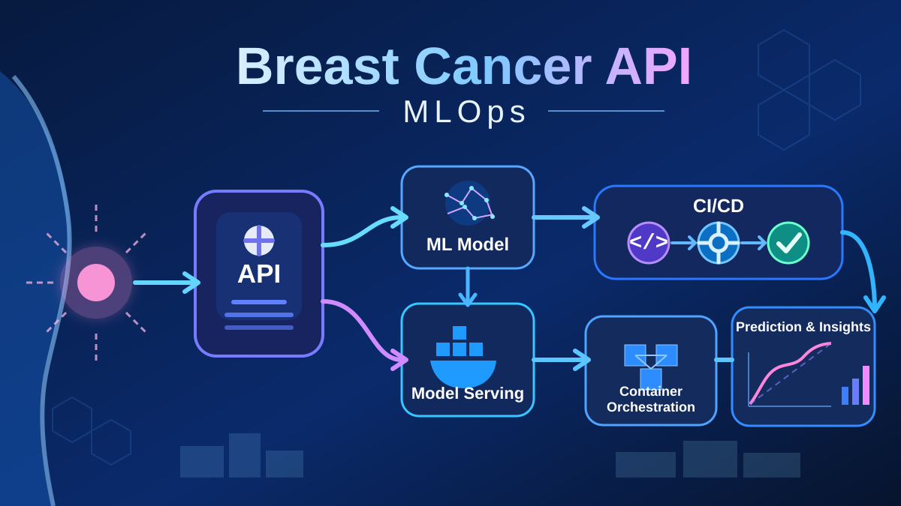

# Jorge Auad Oliva — Portafolio de Datos, BI y Machine Learning

**Ingeniero Estadístico | Analista de Datos / BI | Data Science & Machine Learning Junior**

Portafolio orientado a roles junior en datos, analítica y Machine Learning. Los proyectos priorizan **reproducibilidad, validación metodológica, explicabilidad, calidad de datos y comunicación técnica**.

📍 San Pedro de la Paz, Biobío, Chile  
🔗 [LinkedIn](https://www.linkedin.com/in/jorge-auad-oliva/) · ✉️ [Contacto por correo](mailto:jorgeauad.oliva@gmail.com?subject=Contacto%20desde%20GitHub)

---

## Vista rápida para reclutadores

| Proyecto | Foco | Evidencia técnica |
|---|---|---|
| [Interpretabilidad de Scoring Crediticio](https://github.com/Koke-Oliva/Interpretabilidad-de-Scoring-Crediticio) | ML clásico + explicabilidad | ROC-AUC **0.8394**, PR-AUC **0.8287**, SHAP/LIME, threshold OOF, CV sin leakage |
| [Notas Clínicas con BETO](https://github.com/Koke-Oliva/nlp-notas-clinicas-bert) | NLP + validación robusta | Auditoría de shortcuts, TF-IDF/NB, Word2Vec/RF, BETO, LIME, template-held-out validation |
| [Breast Cancer API](https://github.com/Koke-Oliva/breast_cancer_api) | MLOps + API + CI/CD | F1 **0.9512**, ROC-AUC **0.9974**, model card, Flask, Docker, smoke tests, GHCR |
| [HESPE — PySpark ML Pipeline](https://github.com/Koke-Oliva/hespe-pyspark-student-performance) | Big Data / Spark ML | PySpark, Spark ML Pipeline, CV estratificado, tuning, análisis multiclase y métricas ordinales |
| [Admisión Escolar en R](https://github.com/Koke-Oliva/admision-escolar-r) | Calidad de datos + KPIs | Validación, consolidación, indicadores y reporte automatizado |
| [Monitoreo MCA](https://github.com/Koke-Oliva/monitoreo-mca-alertas-tempranas) | Analítica operativa | Python + SQLite + Excel + alertas tempranas + informe ejecutivo |
| [Ventas Power BI](https://github.com/Koke-Oliva/analisis-ventas-powerbi) | BI | Power Query, DAX, visualización e informe interactivo |

---

# Proyectos destacados — Machine Learning y MLOps

## 1) Interpretabilidad de Scoring Crediticio

**Problema:** clasificación binaria de riesgo de morosidad con datos públicos de OpenML.

**Qué demuestra:**
- separación train/test estratificada;
- `Pipeline` para evitar leakage en validación cruzada;
- Regresión Logística regularizada y Random Forest;
- `GridSearchCV` + `StratifiedKFold`;
- Accuracy, Precision, Recall, F1, ROC-AUC y PR-AUC;
- análisis de umbral usando predicciones out-of-fold;
- interpretabilidad global/local mediante **SHAP y LIME**;
- diagnóstico por subgrupos de edad;
- ejecución end-to-end validada con GitHub Actions.

**Resultados principales:**

| Modelo / configuración | ROC-AUC | PR-AUC | Recall | F1 |
|---|---:|---:|---:|---:|
| Random Forest optimizado | **0.8394** | **0.8287** | 0.7535 | 0.7599 |
| Random Forest — threshold OOF 0.43 | 0.8394 | 0.8287 | **0.8115** | **0.7694** |
| Regresión Logística optimizada | 0.7950 | 0.8094 | 0.5915 | 0.6813 |

**Stack:** Python · pandas · scikit-learn · SHAP · LIME · Matplotlib · Jupyter · GitHub Actions

➡️ [Ver repositorio y notebook ejecutado](https://github.com/Koke-Oliva/Interpretabilidad-de-Scoring-Crediticio)

---

## 2) Clasificación de Notas Clínicas con BETO

**Problema:** clasificación multiclase de gravedad (`leve`, `moderado`, `severo`) sobre 200 notas clínicas sintéticas.

El valor principal de este proyecto no es una métrica perfecta, sino la **auditoría de generalización**. El análisis detectó duplicados, target proxies y familias de plantillas que inflaban los resultados de un split aleatorio.

**Qué demuestra:**
- EDA y auditoría de calidad del corpus;
- detección de duplicados y shortcuts;
- comparación **TF-IDF + Naive Bayes**, **Word2Vec + Random Forest** y **BETO**;
- validación aleatoria vs. **template-held-out validation**;
- separación correcta train/validation/test para BETO;
- análisis de errores;
- desempeño por género y edad como auditoría descriptiva;
- explicabilidad local con **LIME**;
- reproducibilidad con GitHub Actions.

**Hallazgo metodológico central:**

| Modelo | Macro F1 — CV aleatoria | Macro F1 — templates no vistos |
|---|---:|---:|
| TF-IDF + MultinomialNB | **1.0000** | **0.2236** |
| Word2Vec + Random Forest | **0.9789** | **0.1365** |

En el holdout robusto, BETO obtuvo **Macro F1 = 0.1181** y recall de `severo = 0.00`. Esto muestra que el 100% del experimento original no representaba generalización clínica.

**Stack:** Python · spaCy · gensim/Word2Vec · scikit-learn · TensorFlow · Hugging Face Transformers · BETO · LIME

> Dataset sintético y proyecto formativo. No corresponde a un sistema clínico real.

➡️ [Ver repositorio y análisis de shortcuts](https://github.com/Koke-Oliva/nlp-notas-clinicas-bert)

---

## 3) Breast Cancer API — MLOps end-to-end

**Problema:** servir un modelo de clasificación como API REST reproducible y testeada.

**Qué demuestra:**
- entrenamiento reproducible con Random Forest;
- `GridSearchCV` + validación cruzada estratificada;
- métricas de clasificación y calibración;
- **model card** versionada;
- contrato de entrada para 30 features;
- validación de schema, tipos, finitud, rangos y batch;
- Flask + Gunicorn;
- Docker con usuario no-root y `HEALTHCHECK`;
- tests de endpoints;
- Docker smoke tests reales;
- CI/CD con GitHub Actions;
- publicación automática en GHCR.

**Resultados del modelo:**

| Métrica | Test |
|---|---:|
| Accuracy | **0.9649** |
| Precision — malignant | **0.9750** |
| Recall — malignant | **0.9286** |
| F1 — malignant | **0.9512** |
| ROC-AUC | **0.9974** |
| PR-AUC | **0.9957** |
| Brier score ↓ | **0.0285** |

**Stack:** Python · scikit-learn · Flask · Gunicorn · Docker · pytest · GitHub Actions · GHCR

> Proyecto demostrativo de MLOps. No es un dispositivo médico ni un sistema para decisiones clínicas.

➡️ [Ver API, model card y pipeline CI/CD](https://github.com/Koke-Oliva/breast_cancer_api)

---

# Proyectos de Datos, BI y Monitoreo

## HESPE — Student Performance con PySpark

**Foco:** clasificación multiclase de rendimiento estudiantil utilizando **PySpark / Spark ML** y un pipeline reproducible de preprocesamiento, validación cruzada y tuning.

- 145 estudiantes, 31 predictores y 8 categorías de nota;
- schema explícito y EDA con transformaciones Spark;
- split y **Cross-Validation estratificados**;
- baseline con Logistic Regression multinomial;
- Random Forest con `ParamGridBuilder` + `CrossValidator`;
- Accuracy, Weighted/Macro F1, métricas por clase y matriz de confusión;
- métricas ordinales para considerar la distancia entre categorías;
- feature importance agregada a variables originales;
- CI end-to-end con Java 17 + PySpark en GitHub Actions.

**Resultado principal:** Random Forest tuned con Accuracy **0.3793**, Weighted F1 **0.3150**, Macro F1 **0.2839** y **62.07%** de predicciones a ±1 categoría.

> El dataset académico es demasiado pequeño para demostrar una ventaja de throughput de Spark; el proyecto evidencia diseño de pipelines distribuibles y criterio metodológico.

➡️ [Ver repositorio HESPE PySpark](https://github.com/Koke-Oliva/hespe-pyspark-student-performance)

---

## Admisión Escolar — Validación, Monitoreo e Indicadores en R

**Foco:** calidad de datos, integración de tablas, reglas de consistencia, indicadores operativos y reporte reproducible.

- datos simulados;
- scripts en R;
- consolidación de fuentes;
- KPIs por región y nivel;
- reporte automatizado en R Markdown/HTML.

➡️ [Ver repositorio](https://github.com/Koke-Oliva/admision-escolar-r)

---

## Monitoreo MCA — Alertas Tempranas

**Foco:** transformar registros operativos sintéticos en información útil para seguimiento y gestión.

- Python + pandas + NumPy;
- validación de calidad de información;
- consolidación de bases;
- indicadores de gestión;
- reglas de alertas tempranas;
- SQLite + consultas SQL;
- salidas Excel/CSV;
- informe ejecutivo publicado con GitHub Pages.

➡️ [Ver repositorio](https://github.com/Koke-Oliva/monitoreo-mca-alertas-tempranas)  
➡️ [Ver informe ejecutivo](https://koke-oliva.github.io/monitoreo-mca-alertas-tempranas/)

---

## SQL Server — Gestión de Datos Escolares

**Foco:** modelado relacional y consultas SQL para extracción y análisis.

- creación de base y tablas;
- relaciones según modelo entidad-relación;
- filtros, manejo de nulos y agregaciones;
- consultas sobre estudiantes, profesores, cursos y asignaciones.

➡️ [Ver repositorio](https://github.com/Koke-Oliva/sql-server-gestion-colegio)

---

## Power BI — Análisis de Ventas

**Foco:** transformación, modelado y visualización de información comercial.

- importación desde CSV y Excel;
- transformación de datos;
- medidas y tablas calculadas con DAX;
- informe de tres páginas;
- análisis por segmento, país y métricas de ventas/deuda.

➡️ [Ver repositorio](https://github.com/Koke-Oliva/analisis-ventas-powerbi)

---

# Competencias que evidencia este portafolio

### Data Science / Machine Learning
Python · pandas · NumPy · scikit-learn · clasificación · validación cruzada · tuning · evaluación · explainability · SHAP · LIME

### NLP
TF-IDF · spaCy · Word2Vec · Transformers · BETO · análisis de errores · shortcut detection

### MLOps / Ingeniería
Flask · REST API · Docker · Gunicorn · pytest · GitHub Actions · CI/CD · GHCR · model cards · reproducibilidad

### Datos / BI
SQL · SQL Server · SQLite · R · Power BI · DAX · Excel · Power Query · validación de datos · KPIs · reportería

### Buenas prácticas aplicadas
- separación rigurosa entre entrenamiento, validación y test;
- prevención de leakage;
- métricas adecuadas al problema;
- análisis de limitaciones y riesgo de modelo;
- documentación orientada a reproducibilidad;
- pruebas automatizadas;
- uso de datos sintéticos cuando corresponde;
- comunicación diferenciada para público técnico y no técnico.

---

# Formación técnica seleccionada

- **Ingeniero Estadístico** — Universidad del Bío-Bío.
- **Especialización en Machine Learning (198 h)** — IT Academy / Kibernum, Talento Digital para Chile.
- **Bootcamp Ciencia de Datos (168 h)** — IT Academy / Kibernum, Talento Digital para Chile.
- **Diplomado en Data Science** — PUCV.
- Formación complementaria en **SQL Server, Power BI, Excel/Power Query e IA generativa**.

---

## Contacto

[LinkedIn](https://www.linkedin.com/in/jorge-auad-oliva/) · [GitHub](https://github.com/Koke-Oliva) · [Correo](mailto:jorgeauad.oliva@gmail.com?subject=Contacto%20desde%20GitHub)

